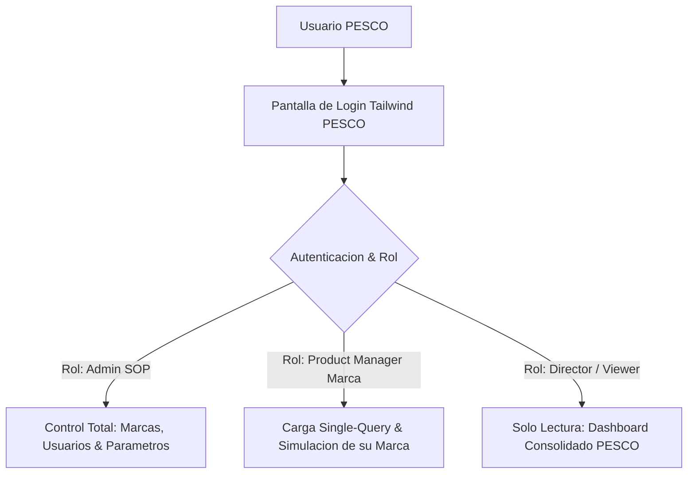
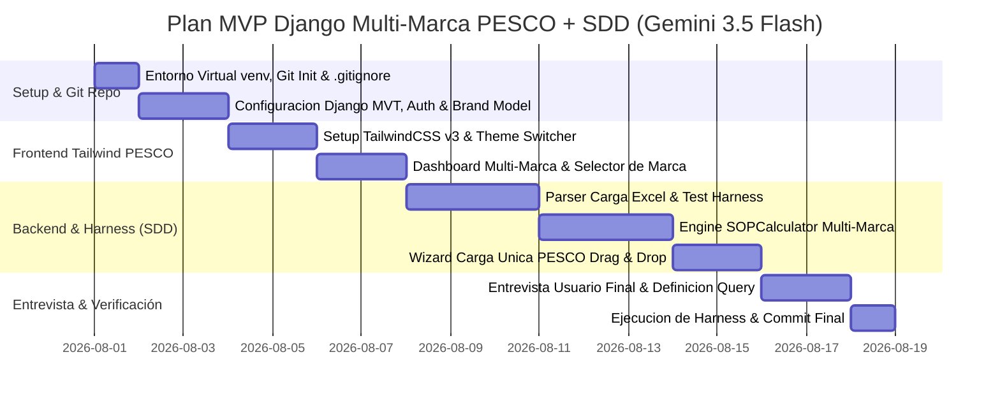

# Análisis Técnico y Diseño de Arquitectura: Calculadora de Compras y S&OP PESCO (Multi-Marca)
**De Planillas Excel por Marca a Plataforma Web Unificada PESCO (Python / Django MVT + TailwindCSS + Robust Auth RBAC + Spec-Driven Development & Agent Harness)**

---

## 1. Resumen Ejecutivo y Diagnóstico del Sistema Actual

El sistema actual analizado se basa en el archivo **`S&OP - Análisis HIAB (Julio) 1.xlsx`** (~1.6 MB, 13 pestañas de cálculo y datos). 

Actualmente, este archivo atiende únicamente a la línea de grúas **HIAB**. Sin embargo, la visión estratégica de **PESCO S.A.** requiere transformar esta herramienta en una **Calculadora S&OP Multi-Marca Unificada**, capaz de gestionar el inventario, tránsito, backlog y presupuesto de todas las líneas de la empresa (HIAB, Terex, Multilift, Epsilon, Rosenbauer, Bucher, etc.) en un solo lugar.

### Diagnóstico de la Problemática Multi-Marca Actual

| Aspecto | Estado Actual en Excel | Solución Plataforma Web PESCO |
| :--- | :--- | :--- |
| **Silos por Marca** | Múltiples planillas Excel separadas por marca o línea de negocio. | **Consolidación Unificada**: Una sola base de datos PostgreSQL con filtro dinámico por Marca / Línea. |
| **Carga de Datos** | Extracciones parciales copiadas y pegadas manualmente en 10 pestañas por cada archivo. | **Estrategia Híbrida**: Carga manual estructurada en MVP mientras se levanta la Query Master consolidada con TI. |
| **Visión Ejecutiva** | Imposible ver el capital total inmovilizado en stock y tránsito de todo PESCO en tiempo real. | **Dashboard Global PESCO**: KPIs consolidados de la compañía con desglose por marca (Drill-down). |
| **Tratamiento de Errores** | Uso de `=SI.ERROR(BUSCARV(...), "0")` que oculta descalces. | **Parser Sintáctico con Alertas**: Identifica SKUs nuevos o marcas no registradas antes de procesar. |

---

## 2. Estrategia del MVP & Entrevista al Usuario Final

Para el desarrollo inmediato del MVP mantendremos la **Carga de Archivos Excel** como mecanismo principal, permitiendo probar la herramienta con el archivo actual mientras se realiza la entrevista de levantamiento con el usuario final para definir la Query única de TI.

```
┌────────────────────────────────────────────────────────────────────────┐
│                   FASE 1: MVP CABLEADO A EXCEL (HOY)                    │
│   • Carga del archivo actual (S&OP - Análisis HIAB) y plantilla única  │
│   • Motor de Cálculo Python + Arnés de Pruebas (Golden Dataset)        │
│   • Interfaz Django MVT + TailwindCSS PESCO + Modo Claro/Oscuro        │
└──────────────────────────────────┬─────────────────────────────────────┘
                                   │
                                   ▼
┌────────────────────────────────────────────────────────────────────────┐
│              FASE 2: LEVANTAMIENTO & QUERY TI (ENTREVISTA)             │
│   • Entrevista con usuario final / Planner S&OP                        │
│   • Definición de campos requeridos de SAP para todas las marcas       │
│   • Especificación técnica de la Query Master Consolidada              │
└──────────────────────────────────┬─────────────────────────────────────┘
                                   │
                                   ▼
┌────────────────────────────────────────────────────────────────────────┐
│              FASE 3: INTEGRACIÓN SAP SERVICE LAYER API                 │
│   • Conexión directa a la API REST de SAP Business One                 │
└────────────────────────────────────────────────────────────────────────┘
```

### Guía / Checklist de Entrevista para el Usuario Final

Para el levantamiento con el usuario final de S&OP, se recopilará la siguiente información:

1. **Catálogo de Marcas y Cobertura**:
   - ¿Qué otras marcas de PESCO además de HIAB (ej. Terex, Multilift, Epsilon, etc.) se deben incluir en la calculadora?
   - ¿Existen códigos de producto compartidos o con diferente estructura por marca?
2. **Origen de las Extracciones SAP Actuales**:
   - ¿De qué reportes o transacciones de SAP B1 se obtienen los datos de `Stock`, `Tránsito`, `Backlog` y `Ventas`?
   - ¿Con qué frecuencia (diaria, semanal, mensual) se extraen esos reportes de SAP?
3. **Criterios de Agrupación y Reglas de Negocio**:
   - ¿Cómo clasifican las grúas y equipos en Familias y Subfamilias?
   - ¿Existen reglas de cálculo de costos de importación o descuentos especiales por proveedor que varíen por marca?
4. **Campos Clave para la Query Única con TI**:
   - Confirmar si la lista propuesta de campos (`ItemCode`, `Brand`, `WhsCode`, `Serial`, `OnHand`, `TransitType`, `OpenQty`, `DocDueDate`, `Customer`, `PriceUSD`, `CostUSD`) cubre todas las necesidades de visualización.

---

## 3. Modelo de Datos Relacional Multi-Marca (Django ORM)

```python
# core/models.py (Estructura Multi-Marca PESCO)

from django.db import models

class Brand(models.Model):
    name = models.CharField(max_length=100, unique=True) # Ej: HIAB, TEREX, MULTILIFT, EPSILON
    code = models.CharField(max_length=20, unique=True)   # Ej: HIAB, TRX, MLT
    is_active = models.BooleanField(default=True)

    def __str__(self):
        return self.name

class Product(models.Model):
    brand = models.ForeignKey(Brand, on_delete=models.PROTECT, related_name='products')
    item_code = models.CharField(max_length=50, unique=True, db_index=True)
    description = models.CharField(max_length=255)
    origin = models.CharField(max_length=20, choices=[('VENTA', 'Venta'), ('COMPRA', 'Compra')])
    family = models.CharField(max_length=100)
    subfamily = models.CharField(max_length=100)
    is_truck_mounted = models.BooleanField(default=False)

    def __str__(self):
        return f"[{self.brand.code}] {self.item_code} - {self.description}"

class SOPSession(models.Model):
    name = models.CharField(max_length=100)
    uploaded_at = models.DateTimeField(auto_now_add=True)
    file_name = models.CharField(max_length=255)
    brand_filter = models.ForeignKey(Brand, on_delete=models.SET_NULL, null=True, blank=True) # None = Todo PESCO
    
    # KPIs Consolidados
    initial_inventory_val = models.DecimalField(max_digits=18, decimal_places=2)
    final_inventory_val = models.DecimalField(max_digits=18, decimal_places=2)
    final_projected_val = models.DecimalField(max_digits=18, decimal_places=2)
    rotation_months = models.DecimalField(max_digits=6, decimal_places=2)
```

---

## 4. Arquitectura de Seguridad & Autenticación Robusta Django (RBAC)



---

## 5. Diseño UI/UX: TailwindCSS PESCO + Selector de Marca & Modo Claro/Oscuro

### A. Selector de Marca en el Header
La barra superior contará con un **Selector de Marca Principal**:
- `[ Global PESCO (Todas las Marcas) ]`
- `[ Línea HIAB ]`
- `[ Línea TEREX ]`
- `[ Línea MULTILIFT ]`
- `[ Línea EPSILON ]`

### B. Paleta Corporativa PESCO (`tailwind.config.js`)
- **Azul Primario (Pesco Blue)**: `#00A8FF`
- **Rojo Secundario (Pesco Red)**: `#E30613`
- **Amarillo Alerta**: `#FFC700`
- **Negro / Dark Header**: `#111827`
- **Superficie Oscura**: `#1E293B`

---

## 6. Plan de Implementación y Hoja de Ruta



---

## 7. Conclusión

La estrategia adoptada permite **avanzar de forma ágil e inmediata con el MVP** soportando las cargas de archivos actuales, mientras en paralelo la entrevista con el usuario final nos dará las definiciones exactas para solicitar la Query única consolidada a TI.
